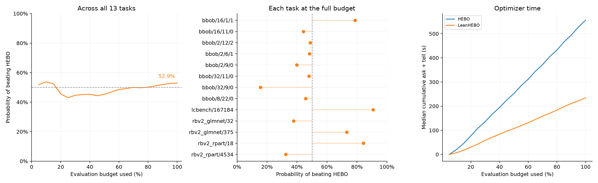
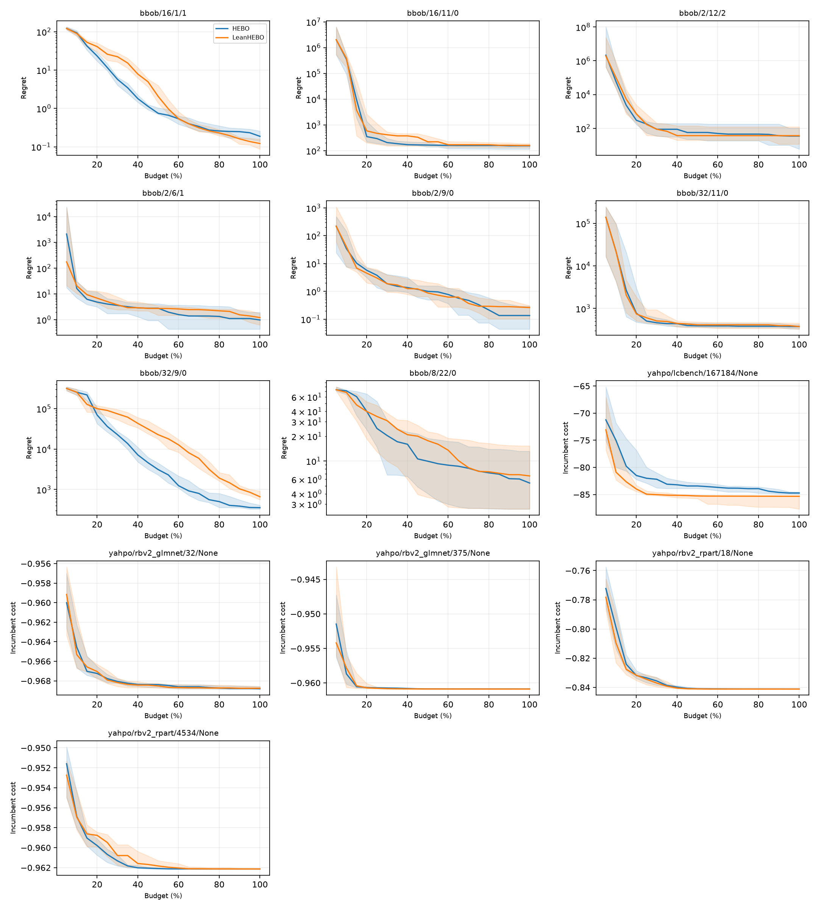

# HEBO comparison

Historical comparison: LeanHEBO 0.3.0 and HEBO 0.3.6 on 13 flat CARP-S tasks, 20 seeds per task, one CPU thread. These runs predate LeanHEBO 0.5.0.

Win probability compares every optimizer run with every HEBO run on the same task, counts ties as half, then averages tasks equally. 50% is neutral. Anytime probability averages 20 budget fractions from 5% to 100%. This measures how often an optimizer wins; task costs show the size of the differences.

Failed runs retain their best evaluated cost for the remaining budget. Timing uses only task/seed pairs completed by every compared optimizer. Intervals in task plots are interquartile ranges, not confidence intervals.

| Optimizer | Final win vs HEBO | Anytime win vs HEBO | Median ask + tell (s) | HEBO/optimizer | Failed runs |
|---|---:|---:|---:|---:|---:|
| HEBO | 50.0% | 50.0% | 555.55 | 1.00x | 3/260 |
| LeanHEBO | 52.9% | 48.7% | 234.42 | 3.08x | 0/260 |

| Task | Optimizer | Median final cost | Median paired delta vs HEBO |
|---|---|---:|---:|
| bbob/16/1/1 | HEBO | 79.66727 | +0 |
| bbob/16/1/1 | LeanHEBO | 79.60171 | -0.06397171 |
| bbob/16/11/0 | HEBO | 52.39951 | +0 |
| bbob/16/11/0 | LeanHEBO | 57.59259 | -1.446998 |
| bbob/2/12/2 | HEBO | -220.3214 | +0 |
| bbob/2/12/2 | LeanHEBO | -218.3622 | +2.98696 |
| bbob/2/6/1 | HEBO | 36.87155 | +0 |
| bbob/2/6/1 | LeanHEBO | 37.10328 | +0.1712602 |
| bbob/2/9/0 | HEBO | -359.3045 | +0 |
| bbob/2/9/0 | LeanHEBO | -359.1775 | +0.1208521 |
| bbob/32/11/0 | HEBO | 273.7683 | +0 |
| bbob/32/11/0 | LeanHEBO | 273.8252 | -2.80471 |
| bbob/32/9/0 | HEBO | -4.253313 | +0 |
| bbob/32/9/0 | LeanHEBO | 301.8161 | +269.9548 |
| bbob/8/22/0 | HEBO | 48.37917 | +0 |
| bbob/8/22/0 | LeanHEBO | 49.56492 | +0.001613618 |
| yahpo/lcbench/167184/None | HEBO | -84.72795 | +0 |
| yahpo/lcbench/167184/None | LeanHEBO | -85.3306 | -1.933781 |
| yahpo/rbv2_glmnet/32/None | HEBO | -0.9688155 | +0 |
| yahpo/rbv2_glmnet/32/None | LeanHEBO | -0.9687665 | +5.358458e-05 |
| yahpo/rbv2_glmnet/375/None | HEBO | -0.9608903 | +0 |
| yahpo/rbv2_glmnet/375/None | LeanHEBO | -0.9609004 | -8.255243e-06 |
| yahpo/rbv2_rpart/18/None | HEBO | -0.8411799 | +0 |
| yahpo/rbv2_rpart/18/None | LeanHEBO | -0.8411871 | -6.377697e-06 |
| yahpo/rbv2_rpart/4534/None | HEBO | -0.9621401 | +0 |
| yahpo/rbv2_rpart/4534/None | LeanHEBO | -0.9621355 | +4.559755e-06 |
